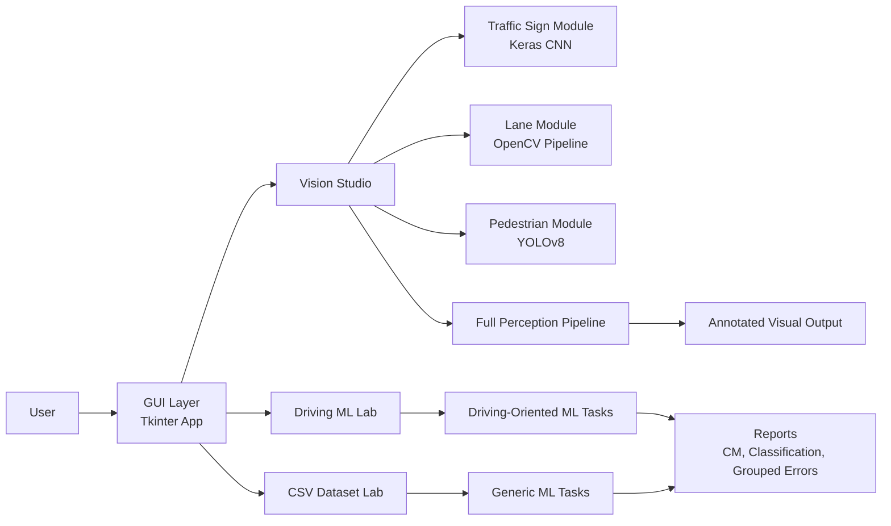
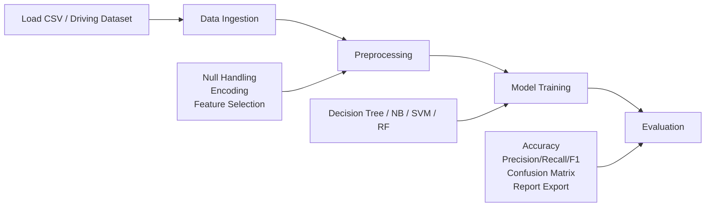
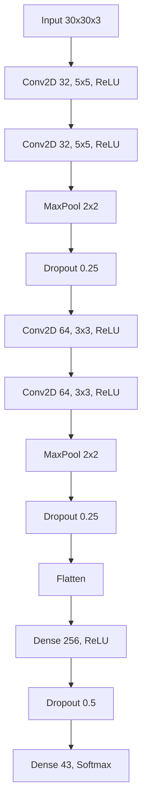
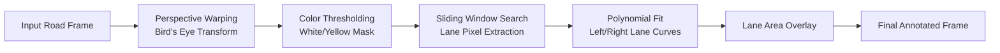

# Autonomous Driving Perception Toolkit

Desktop toolkit for autonomous driving perception experiments, combining deep learning and classical machine learning in a single GUI application.

## Scope
- Vision Studio: traffic sign recognition, lane detection, pedestrian detection, and combined perception pipeline.
- Driving ML Lab: driving-oriented tabular ML workflow with metrics and report artifacts.
- CSV Dataset Lab: generic dataset experimentation (import, train, confusion matrix, report).

## Tech Stack
- Python
- Tkinter + ttkbootstrap
- OpenCV
- TensorFlow / Keras
- Ultralytics YOLOv8
- scikit-learn

## Quick Start
1. Install dependencies:
   `pip install -r requirements.txt`
2. Launch application:
   `python main.py`

## Repository Layout
- `gui/`: desktop UI and orchestration
- `dl_module/`: perception pipelines (traffic sign, lane, pedestrian)
- `ml_module/`: training and evaluation workflows
- `data/`: datasets and metadata
- `models/`: trained model artifacts
- `Public/`: generated reports and visual outputs

## Figures (Mermaid)

### Figure 1: High-Level System Architecture

### Figure 2: Automated ML Pipeline

### Figure 3: Custom Traffic Sign CNN Architecture

### Figure 4: Advanced Lane Pipeline

## Notes
- Designed for CPU-friendly execution.
- Outputs are saved under `Public/` for reproducibility and review.
